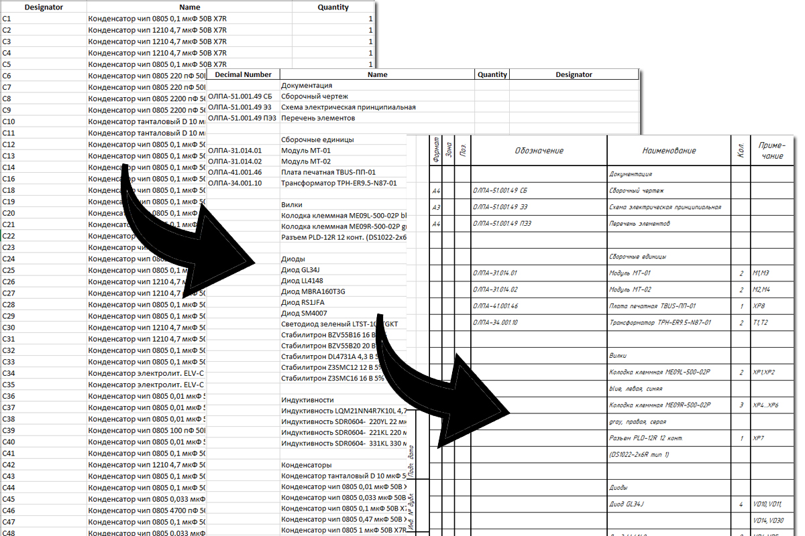

# Программа преобразования Altium Designer bom в перечень элементов и спецификацию по ГОСТ



## Использование
1. Подготовьте входящую спецификацию:
   - Создайте файл OutputJob в Altium Designer.
   - В файле OutputJob нажмите *Add New Report Output -> Bill of Material*.
   - Нажмите на появившуюся строку правой кнопкой мыши и выберите Configure.
   - В поле Properties на вкладке General в строке Template укажите файл шаблона [templates/altium_template.xlsx](templates/altium_template.xlsx).
   - В поле Properties на вкладкe Columns выберите столбцы **Designator, Name, Quantity, Decimal Number**. *Не сортируйте ни один столбец!* Нажмите Ok.
   - Создайте и настройте Output Container. Сгенерируйте файл входящей спецификации. Положите файл в папку [input](input) внутри папки с программой. Пример входящей спецификаци можно посмотреть в [examples/bom_from_altium.xlsx](examples/bom_from_altium.xlsx).
2. Подготовьте файл документации для спецификации. Пример можно посмотреть в [examples/docs_for_specification.xlsx](examples/docs_for_specification.xlsx). Возьмите пример за основу для создания вашего файла. Положите файл в папку [input](input) внутри папки с программой.
3. Запустите программу и следуйте её инструкциям (см. [Запуск программы](#Запуск-программы)).
4. Исходящие файлы программа сохраняет в папку папку output.


## Запуск программы
1. Проверьте, установлен ли python. В коммандной строке выполните
```
python --version
```
2. Если python не установлен, установите его по ссылке: [www.python.org/downloads](https://www.python.org/downloads/)
3. Перейдите в папку программы в коммандной строке
```
cd /d "С:/path/to/folder"
```
4. Выполните
```
pip install -r requirements.txt
```
5. В коммандной строке запустите программу
```
cls; python .\main.py
```
6. Следуйте указаниям программы